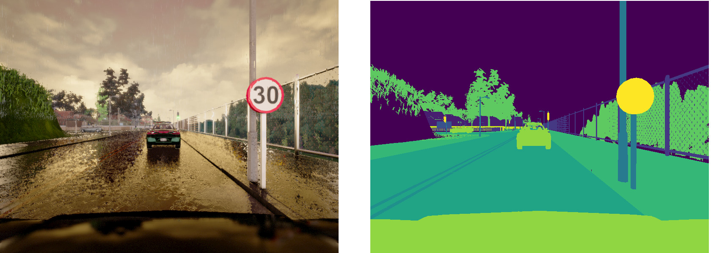
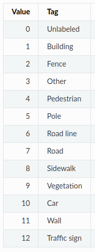

# Sujet de projet AADA - janvier 2021

Ce projet a pour objet de développer un réseau convolutif similaire au réseau appelé U-net capable de segmenter les objets contenus dans une image.

Un algorithme de segmentation permet de détecter chaque objet contenu dans une image en identifiant/labelisant chaque pixels qui composent chacun d'entre eux. Le résultat de la segmentation peut être représenté par plusieurs masks, chaque mask étant une image dans laquelle un pixel prend la valeur 1 lorsqu'il appartient à un même type d'objet et la valeur 0 lorsque le pixel n'appartient pas à cet objet.

Le reseau que je propose d'implanter prend donc en entree l'image a segmenter et infere en sortie une image dont le nombre de plan est egal au nombre dee classes dans lesquels nous souhaitons classer chaque pixel de l image d´entree. Par exemple, nous pourrions choisir de segmenter les batiments, les voitures, la vegetation : l´image de sortie serait alors composer de trois plans comme une image couleur.

A titre d'illustration, les deux images suivantes représentent une image couleur acquise dans un environnement routier du simlulateur ***CARLA*** (http://carla.org) et le mask des pixels correspondant. Dans ce mask vous observez que les pixels ont une couleur différente fonction de leur appartenance : les pixels jaune appartiennent à la classe "signalisation verticale", les pixels d'un certain vert appartiennent à la végétation, les pixels gris appartiennent à la chaussée. 



Le réseau U-net est défini par l'architecture suivante :


Dans cette architecture, l'entrée du réseau est à gauche et la sortie à droite. Ainsi en présentant (en mode test) une image à l'entrée du réseau, nous obtenons en sortie plusieurs masks de même résolution que l'image d'entrée (un mask par objet à détecter). L'ensemble des poids est estimé en présentant un batch d'images en entrée du réseau, en imposant la sortie (i.e. les masks des objets à détecter) et en appliquant une méthode d'optimisation (ADAM par exemple).

L'image d'entrée peut etre codée en niveau de gris ou en couleur selon le besoin. La définition des flèches est renseignée sur le schéma précédent.

Le réseau se compose donc de deux parties. La première partie (située a gauche) définie par une succession de couches de convolution, d'activation et de max pooling comme vous l'avez déjà pratiqué lors des séances de TP.
Nous travaillerons sur des images de faibles résolutions. Par conséquent, contrairement à ce qui est indiqué sur l'architecture précédente qui est définie pour les images d'entrée de résolution  572x572, dans notre cas d'usage, les couches successives feront appel respectivement aux nombres de filtres suivants : 16, 16, 32, 32, 64, 64, 128 et 128. Nous obtenons donc 8 feature maps. Contrairement au schema de l U-net, nous n implanterons pas la toute derniere ligne de transformation. Ainsi c est bien la derniere couche de convolution (128 filtres) qui va constituer l entree de la seconde partie du reseau.

La seconde partie du réseau se compose d'une succession de couche de **déconvolution** (ou **up-sampling**) (flèche rouge), de convolution, de **concaténation** et d'activation. Aucune couche de max pooling ne compose la seconde partie du réseau. Deux nouveautés apparaissent ici. La couche de **déconvolution** et la couche de **concaténation**.
Puisqu'il s'agit d'estimer une image de résolution spatiale identique à l'image d'entrée, il est donc nécessaire d'appliquer les traitements capable d'augmenter la taille des volumes de données (l'inverse des max pooling). Pour cela, nous allons utiliser ces deux nouvelles fonctions. 

Les couches de déconvolution sont à instancier avec la fonction ```tf.nn.conv2d_transpose()```.
Pour réaliser ce réseau, la fonction vous est donnée dnas le code ci-après. Elle se nomme ```deconvolution``` et est appelée avec les paramètres suivants  ```d2=deconvolution(result, 3, 64, 2, ph_is_training)```. 

```
result : représente la couche que nous cherchons à déconvoluer
3 : est la taille du noyau
64 : est le nombre de noyaux
2 : est le valeur du stride
ph_is_training : est la variable qui indiquera si nous sommes en apprentissage ou en test.
```

Pour obtenir chaque couche, la taille des noyaux de convolutions est de 3 et leur nombre sera (dans l'ordre d'application) : 64, 64, 32, 32, 16, 16

La dernière convolution qui permet d'obtenir les différents masks de segmentation est réalisée avec un noyau de 1 et avec un nombre de filtre égal aux nombres de classes. Ainsi, la sortie sera une image avec un nombre de plan egal au nombre de classes retenues.

Attention : après la déconvolution, nous devrez appliquer une couche d'activation (Relu) comme vous le faisiez après une couche de convolution.

Votre travail est d'appeler la fonction déconvolution de la bonne manière i.e. aux bons endroits de l'architecture afin de construire le réseau conformément à ce qui est indiqué dans le schéma de l'architecture précédent.

La fonction de concaténation ```result=tf.concat((d2, c2), axis=3) ``` est appliquée afin d'assembler les volumes de données de la partie gauche du réseau et de la partie droite. Les couches de la partie gauche du réseau sont celles situées juste avant le max-pooling. Les couches de la partie droite sont celles située après l'appel de la fonction de déconvolution. Les deux couches concaténées requièrent les mêmes résolutions spatiales. Ainsi, cette opération s'effectue selon la troisième composante i.e. la profondeur ```axis=3``` (le nombre de filtres).

## Structure du code

Voici la structure du code qu'il vous faut compléter.

> Question 1 : Compléter le code. Ce qui est à faire est spécifié entre **[...]**

> Question 2 : Donner les trois dimensions de chaque couche du réseau à l'aide d'un commentaire ***# nom_couche size1 x size2 x size3***

L'apprentissage est à réaliser sur la base d'images ***lyft-udacity-challenge*** (https://www.kaggle.com/kumaresanmanickavelu/lyft-udacity-challenge) qu'il faudra placer sur votre drive.
Afin de réduire le temps de transfert sur le Google drive vous pouvez ne transférer que les dossier dataA et dataB. Afin de réduire les temps de traitement pendant l'apprentissage, j'ai réduit la résolution des images à 160 x 120 lors du conditionnement des données pour l'apprentissage (avec ```cv2.resize()```).

```
import cv2
import os
import tensorflow.compat.v1 as tf 
tf.disable_v2_behavior()
import numpy as np
from sklearn.model_selection import train_test_split

from google.colab import drive
drive.mount('/content/drive')

width=160
height=120

taille_batch=50
nbr_entrainement=100
learning_rate=1E-3
nbr_mask=2

def normalisation(couche_prec)
    [A ECRIRE]

def convolution(input, taille_noyau, nbr_conv, stride, training=False):
    [A ECRIRE]

def deconvolution(input, taille_noyau, nbr_conv, stride, training=False):
    w=tf.Variable(tf.random.truncated_normal(shape=(taille_noyau, taille_noyau, nbr_conv, int(input.get_shape()[-1]))))
    b=np.zeros(nbr_conv)
    out_h=int(input.get_shape()[1])*stride
    out_w=int(input.get_shape()[2])*stride
    b_size=tf.shape(input)[0]
    result=tf.nn.conv2d_transpose(input, w, output_shape=[b_size, out_h, out_w, nbr_conv], strides=[1, stride, stride, 1], padding='SAME')
    result=result+ b
    result=tf.layers.batch_normalization(result, training=training)
    return result


[ARCHITECTURE A ECRIRE AVEC LOSS, ACCURACY et TRAIN]


loss = ...
accuracy = ...


extra_update_ops=tf.get_collection(tf.GraphKeys.UPDATE_OPS)
with tf.control_dependencies(extra_update_ops):
  train=tf.train.AdamOptimizer(learning_rate).minimize(loss)
 
# DATA CONDITIONING

dir_img="CameraRGB/"
dir_mask="CameraSeg/"

# Dans ce dossier, les images sont de résolution 120 x 160
for dir in ['/content/drive/My Drive/dataset/lyft-udacity-challenge/resized/dataA/']:
  for file in os.listdir(dir+dir_img):
    i=i+1
    print(i)
    tab_img.append(cv2.imread(dir+dir_img+file)/255)
    img_mask=cv2.imread(dir+dir_mask+file)[:,:,2]
    img_mask_result=np.zeros(shape=(height, width, 2), dtype=np.float32)
    
    # Pour deux classes de pixels (ici les classes 7 et 9)
    img_mask_result[:,:,0][img_mask==7]=1.
    img_mask_result[:,:,1][img_mask==9]=1.
    
    # Pour ajouter deux classes de pixels supplémentaires (ici les classes 1 et 10) il faut décommenter ces deux lignes
    # img_mask_result[:,:,2][img_mask==1]=1.
    # img_mask_result[:,:,3][img_mask==10]=1.
    
    # Vous pouvez choisir les objets à segmenter qui vous interessent parmis
    # les labels spécifiés dans le tableau qui suit tout le script
    
    tab_mask.append(img_mask_result)
    if i==500:
      break

# Création des tableaux d'images et de masks
tab_img=np.array(tab_img)
tab_mask=np.array(tab_mask)

# Ces tableaux sont splités en un set training et un set testing
train_images, test_images, train_labels, test_labels=train_test_split(tab_img, tab_mask, test_size=.1)

with tf.Session() as s:
  s.run(tf.global_variables_initializer())
  tab_train=[]
  tab_test=[]
  for id_entrainement in np.arange(nbr_entrainement):
      print("> Entrainement", id_entrainement)
      for batch in np.arange(0, len(train_images), taille_batch):
          s.run(train, feed_dict={
              ph_images: train_images[batch:batch+taille_batch],
              ph_masks: train_labels[batch:batch+taille_batch],
              ph_is_training: True
          })
      print("  entrainement OK")
      tab_accuracy_train=[]
      for batch in np.arange(0, len(train_images), taille_batch):
          p=s.run(accuracy, feed_dict={
              ph_images: train_images[batch:batch+taille_batch],
              ph_masks: train_labels[batch:batch+taille_batch]
          })
          tab_accuracy_train.append(p)
      print("  train:", np.mean(tab_accuracy_train))
      tab_accuracy_test=[]
      for batch in np.arange(0, len(test_images), taille_batch):
          p=s.run(accuracy, feed_dict={
              ph_images: test_images[batch:batch+taille_batch],
              ph_masks: test_labels[batch:batch+taille_batch]
          })
          tab_accuracy_test.append(p)
      print("  test :", np.mean(tab_accuracy_test))
      tab_train.append(1-np.mean(tab_accuracy_train))
      tab_test.append(1-np.mean(tab_accuracy_test))
  
  [FAIRE APPARAITRE LES DEUX COURBES DE PERFORMANCE]
  
  saver.save(s, './mon_modele/modele')

```

Les labels qui ont été segmentés dans les images sont les suivants. 



Vous constaterez que les labels 1, 7, 9 et 10 que nous utilisons dans le code précédent sont respectivement Building, Road, Vegetation et Car. Vous pourrez vous amuser à changer les classes que vous souhaitez.

Attention, plus il y a de classes à apprendre, plus le temps de convergence sera élevé (mais raisonnable). Par ailleurs, comme indiqué plus haut, la dimension de la sortie du réseau dépend du nombre de classe à apprendre.


## Script de test du modèle sauvegardé

Ecrire le script permettant de
* Charger le modèle sauvegardé ;
* Tester le modèle sur des images de la base ***lyft-udacity-challenge*** et sur des images réelles que vous trouverez sur le web

> Question 3 : commenter les résultats que vous avez obtenus

